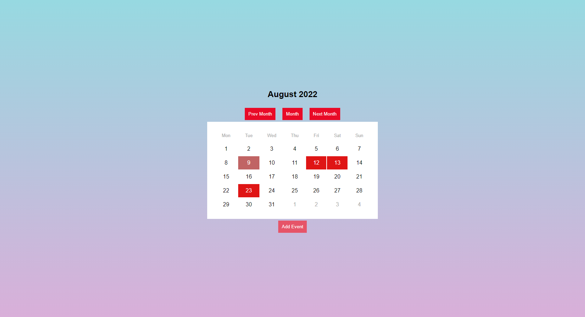

# 📆 BirthdayReportApp

## Table of contents

- ℹ️ [General info](#ℹ️-general-info)
- 🎉[Project overview](#-project-overview)
- 📖 [What I learned during this project?](#-what-i-learned-during-this-project)
- ⚙️ [Technologies](#️-technologies-used-in-project)
- 📷 [Screenshots](#-screenshots)
- 💾 [Installation](#-installation)
- 📜 [Available scripts](#-available-scripts)
- 🔴 [Live](#-live)

## ℹ️ General info

BirthdayReport App (ContextApi + date-fns + Formik + Yup + localStorage)

## 🎉 Project Overview

The project is an application that has a built-in calendar on which, after the user adds a name and a date, a marker appears on the person's date of birth and a reminder 2 weeks back from the date of birth. The data is stored in the browser's localStorage

## 📖 What I learned during this project?

During this project, I used ContextApi to pass data to components. I found the use of many libraries such as date-fns - when creating a calendar, and Formik + Yup when creating a form to add birthdays. The hardest part of this project was making a calendar that has functionality in it, such as changing the weekly / monthly view, and creating logic to read data from the calendar so that when you click on an event, it displays in the modal

## ⚙️ Technologies used in project:

| Tech                                          | Description                                             |
| --------------------------------------------- | ------------------------------------------------------- |
| [React](https://reactjs.org/)                 | A JavaScript library for building user interfaces       |
| [Typescript](https://www.typescriptlang.org/) | Javascript superset language                            |
| [Formik](https://formik.org)                  | Most popular open source form library for React         |
| [Yup](https://github.com/jquense/yup)         | Schema builder for runtime value parsing and validation |
| [Date-fns](https://date-fns.org/)             | Modern JavaScript date utility library                  |
| [Sass](https://sass-lang.com/)                | Css extension                                           |
| [Eslint](https://eslint.org/)                 | Javascript Linter                                       |
| [Prettier](https://prettier.io/)              | Code formatter                                          |

## 📷 Screenshots

<p align="center">
    
</p>

## 💾 Installation

To run this project, install it locally using npm:

```
git clone

npm install

npm start
```

## 📜 Available scripts

| Command         | Description            |
| --------------- | ---------------------- |
| `npm start`     | Open local server      |
| `npm run build` | Create optimized build |

## 🔴 Live

https://chatbot-danilus120.netlify.app/
